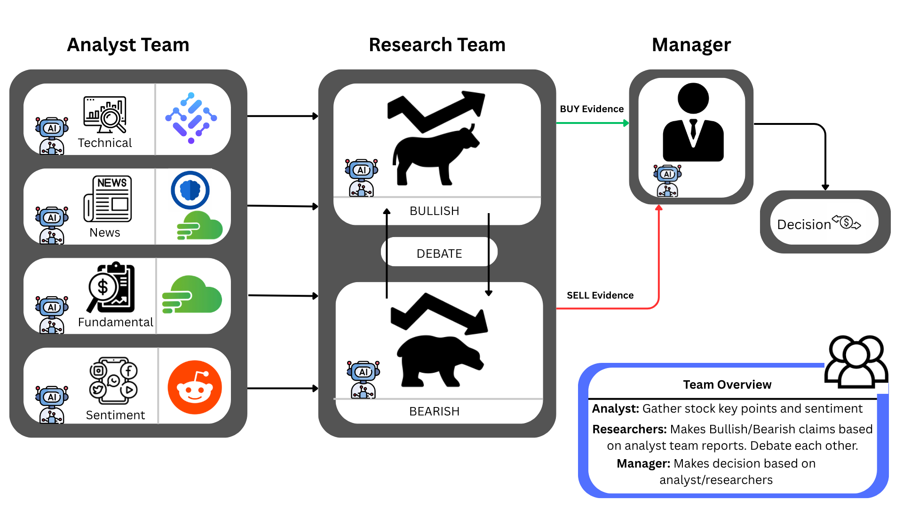
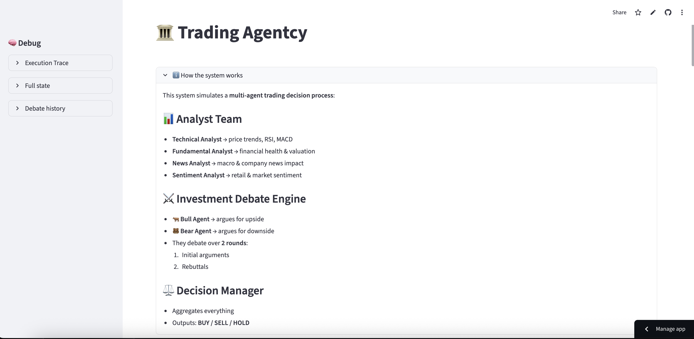
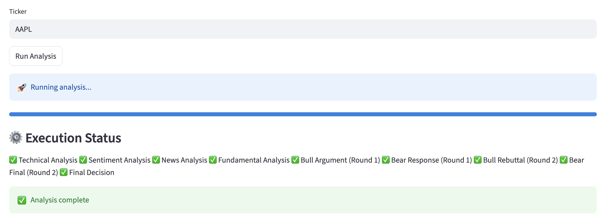
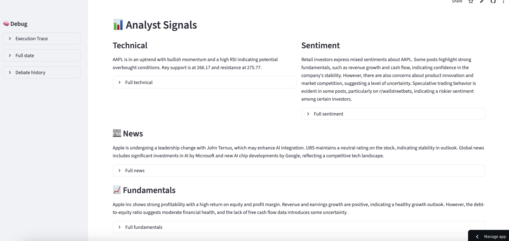
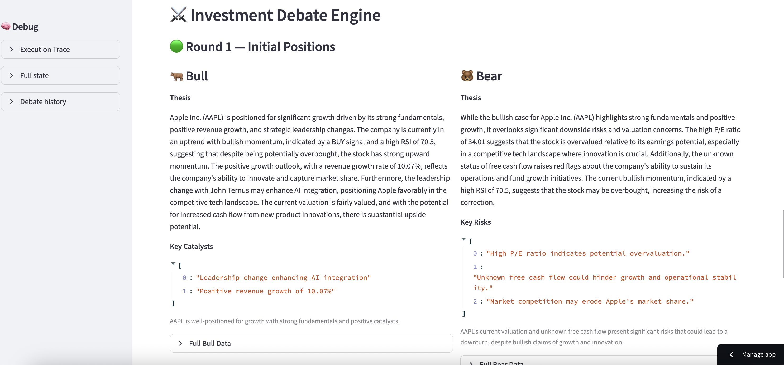
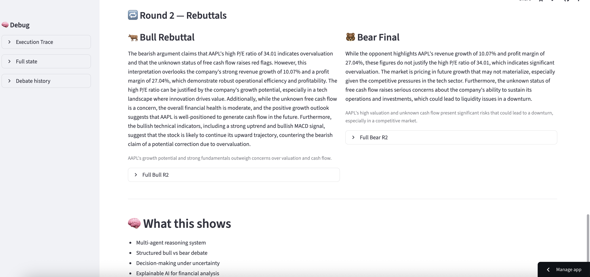
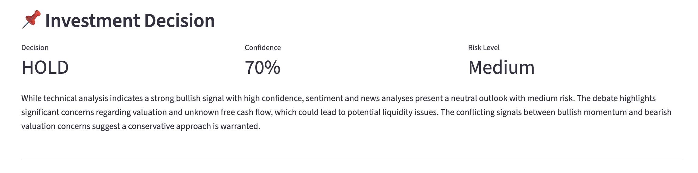

# Trading Agentcy

Trading Agentcy is a multi-agent AI trading system that simulates a real-world investment research firm. It uses LLM-powered agents to analyze financial markets from multiple perspectives including technical analysis, fundamental analysis, sentiment, and news.

The system also includes a **bull vs bear debate engine** that creates adversarial reasoning before producing a final investment decision.

Live Demo: https://tradingagentcy.streamlit.app/
(need password to use)

---

## Disclaimer

This project is intended for **educational and research purposes only**.

- Not financial advice  
- Results are non-deterministic  
- Outputs depend on LLMs and market data quality  
- Do not use for real trading decisions without validation  

---

## System Overview

Trading Agentcy breaks down market analysis into specialized AI agents

### System Overview


### Analyst Agents

- **Technical Analyst**
  - Price trends, momentum, RSI, MACD
  - Support and resistance levels

- **Fundamental Analyst**
  - Valuation metrics (P/E, growth, margins)
  - Financial health and risk analysis

- **News Analyst**
  - Recent company and macroeconomic news
  - Market-impacting events

- **Sentiment Analyst**
  - Market sentiment signals from social media

---

### Debate Engine (Bull vs Bear)

The system includes a structured adversarial reasoning layer:

- **Bull Agent**
  - Builds positive investment case
  - Identifies upside catalysts

- **Bear Agent**
  - Challenges assumptions
  - Identifies risks and downside scenarios

They debate over multiple rounds to refine arguments.

---

### Decision Manager

Final agent that:
- Aggregates all analyst outputs
- Evaluates bull vs bear arguments
- Produces final decision:
  - BUY / SELL / HOLD
- Outputs confidence score and reasoning

---

## System Showcase (Example UI)

Below are example screenshots of the Trading Agentcy system in action:

### Overview


### Progress of process


### Stock Analysis


### Bull vs Bear Debate



### Final Decision Output


---

## Tech Stack

- LangGraph (multi-agent orchestration)  
- LangChain
- LLMs (OpenAI)  
- API:s
- Streamlit (UI dashboard)  
- Python  

---

## Installation

### Clone the repository
```bash
git clone https://github.com/yourusername/trading-agentcy.git
cd trading-agentcy

### Create virtual environment
```bash
python -m venv venv
source venv/bin/activate   # macOS/Linux
venv\Scripts\activate      # Windows
```

### Install dependencies
```bash
pip install -r requirements.txt
```

## Environment Variables

Create a `.env` file (or use Streamlit secrets):

```env
APP_PASSWORD=your_password
OPENAI_API_KEY=your_openai_key
TWELVEDATA_API_KEY=your_key
FINNHUB_API_KEY=your_key
NEWSDATA_API_KEY=your_key
```

## Run the App
```bash
streamlit run app.py
```

## Features
- Multi-agent financial reasoning system
- Technical + fundamental + sentiment + news analysis
- Structured bull vs bear debate engine
- Explainable AI investment decisions
- Real-time market data integration
- Cached API calls for performance optimization

## Design Philosophy
This system is inspired by real hedge fund workflows:
- Separation of analyst roles
- Independent thesis generation
- Structured debate before decision-making
- Centralized decision output

## Future Improvements
- Portfolio allocation agent
- Backtesting framework
- Improved sentiment analysis (Reddit/Twitter integration)
- Memory/RAG-based financial reasoning

## Author
Built by **18alba1**

AI trading research system combining:
- Multi-agent LLM systems
- Financial APIs
- Structured reasoning pipelines
- Streamlit interactive UI